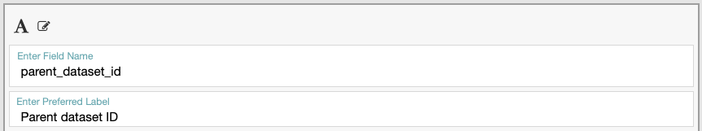
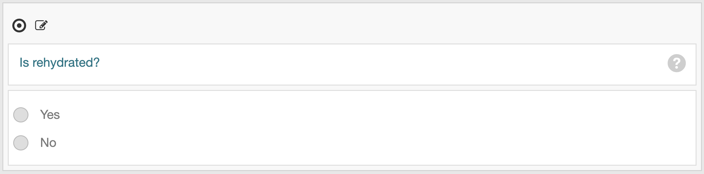
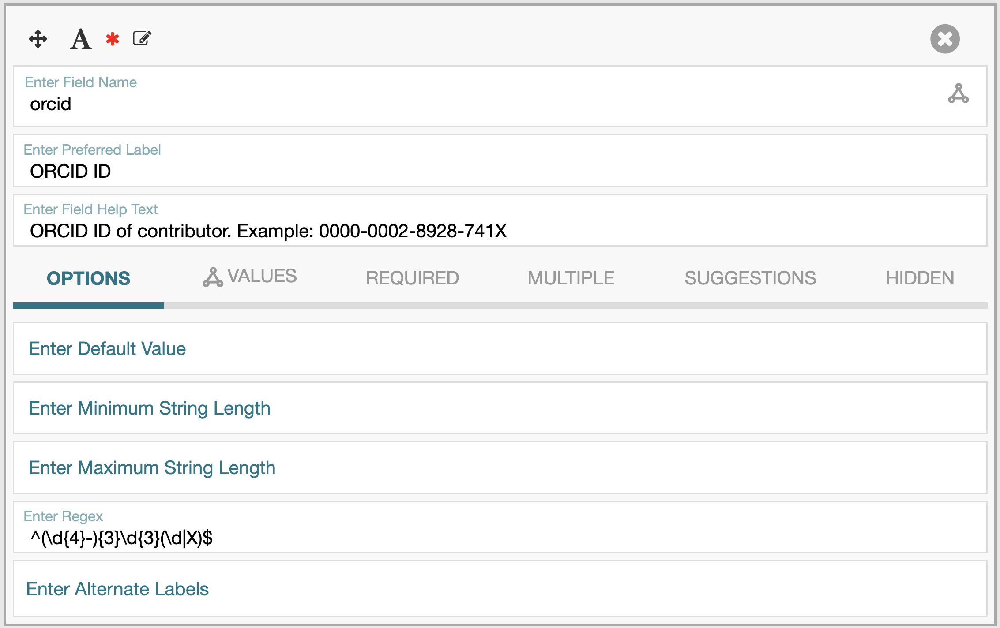

# Best Practices

Follow these best practices when building fields and templates in CEDAR:

1. **Naming Fields**
   
   

   - For the "Field name" label, use snake_case format (e.g., `parent_dataset_id` instead of `Parent Dataset ID`).
   - For the "Preferred Label", use title case format (e.g., `Parent Dataset ID`).

3. **Creating Descriptions**
   - Provide clear and concise descriptions for each field.
   - Include an example value after the description. For example, the "Parent Dataset ID" field description could be:
`Unique identifier of the dataset used to generate this derived dataset. Example: HNDF-123-HH.`.
   - Use ChatGPT or other LLM tools to improve the text quality when writing the description.

4. **Naming Boolean Fields**

   

   Use a question format for boolean fields (e.g., `is_rehydrated`, `is_cell_type_annotation_included`) to indicate a "Yes" or "No" response.

5. **Using Regular Expressions for Identifier Validation**

   

   - Apply regular expressions to ensure identifier fields match specific patterns. To do this, select the "OPTIONS" setting and enter the desired regex in the "Enter Regex" field.
   - Common regex patterns:
     - ORCID: `(\d{4}-){3}\d{3}(\d|X)`
     - DOI: `10\.\d+/.*`
     - UniProt ID: `([A-N,R-Z][0-9]([A-Z][A-Z, 0-9][A-Z, 0-9][0-9]){1,2})|([O,P,Q][0-9][A-Z, 0-9][A-Z, 0-9][A-Z, 0-9][0-9])(\.\d+)?]`
     - ISBN: `(-13|-10)?[:]?[ ]?(\d{2,3}[ -]?)?\d{1,5}[ -]?\d{1,7}[ -]?\d{1,6}[ -]?(\d|X)`
   - *Tip*: Visit [Identifiers.org](https://identifiers.org) for more regex examples.

6. **Using Value Set vs. Multiple Choice**
   - Decide between value sets and multiple choice based on whether the values are shareable concepts. Use Multiple Choice for non-shareable values, such as a collection of input parameters.

## Related Topics

- Return to [building CEDAR templates page](build-templates.md).
- Review the [field library guide](create-field-library.md).
- See [examples of completed templates](https://github.com/hubmapconsortium/dataset-metadata-spreadsheet).
