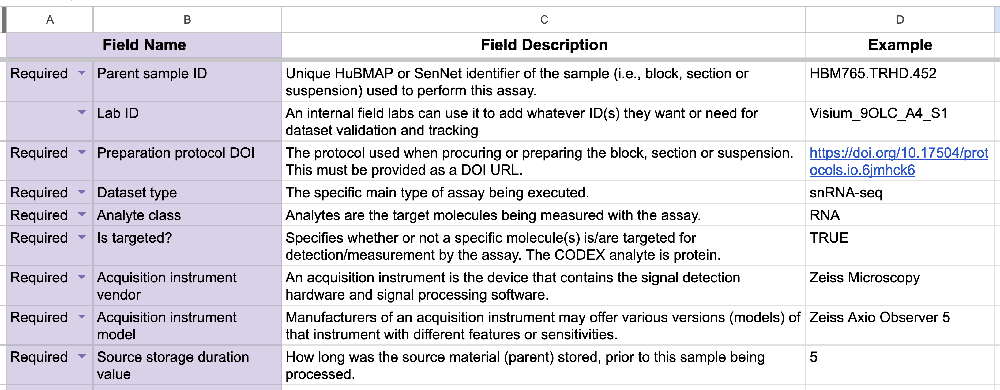

# Building CEDAR Templates for Community Standards

This guide provides a step-by-step process for building metadata templates that adhere to community standards using the [CEDAR platform](https://cedar.metadatacenter.org/).

## Workflow Overview

1. Pre-requisite
2. Planning Phase
3. Building the Template
4. Version Management
5. Sharing to Public
6. Disseminate the Template

## 1. Pre-requisite

* Ensure you have an active CEDAR user account. Follow the steps in this [guide to create a CEDAR account](https://metadatacenter.readthedocs.io/en/latest/user-guide/sections/a1/creating_a_cedar_account/).

* Start by gathering the source metadata specification documents:
  - Spreadsheets (.xlsx, .csv)
  - Text documents (.doc, .pdf)
  - Existing metadata schemas

  These documents outline the required metadata fields according to the established community standards. Figure 1 below shows a typical metadata specification document, structured in a spreadsheet format.

  

## 2. Planning Phase

Before building templates, plan your approach:

* Identify the data fields that will be reused across templates, if you're building more than one.
* Review the [best practices](best-practices.md) for naming the fields and other tips.
* [Begin by building the common data field library](build-common-fields.md) first. 
* Construct the template using the data field library as the foundation.
  
Think of data fields as reusable building blocks--like Lego pieces that can be assembled into different structures.

## 3. Building the Template

### Steps to Create a New Template

Login to your CEDAR account first before following these steps below:

1. Select the "New > Template" button in the top-left corner to create a new template.
2. Replace "Untitled" with the desired template name.
3. In the "Field Type Selector" bar on the right, click the magnifier icon at the bottom to open the field search dialog.
4. Browse the directory structure to find the common data field folder that contains the fields you previously created. Figure 2 below illustrates an example of HuBMAP common data fields. 
6. Accumulate the required fields for the metadata template by clicking the plus icon, then and click the "Select" button to finish.

### Customization Options

On the Template Designer editor page, you can customize the selected fields, including updating the field descriptions to align with the template's context. Below are two common customizations you may encounter.

* **Set Requirement Level**: 
  - On the field panel, click the "REQUIRED" tab.
  - Select "YES" to make the field required, or "NO" to make it optional (default is "NO").
    

* **Add Default Value**: 
  - On the field panel, click the "OPTIONS" tab.
  - Enter the default value in the "Enter Default Value" field.
    

## 4. Version Management 

### Steps to Set a Version

* A newly created CEDAR template always starts with version 0.0.1. To set a version to your template, go to the Workspace View and open the Resource Menu by clicking the vertical dots (the 'kebab menu', ⋮) on the right-hand side of the template.

* Select "Publish Version" and set the version number.
  

Each version of a CEDAR template is assigned a unique UUID and a distinct URL is generated for accessing each one of them.

*Tip*: If you prefer to work in draft mode but want to start with version 1.0.0, first publish the template to get version 0.0.1. Then, select "Create Version" and set it to 1.0.0. Use version 1.0.0 for any future development of the template.

## 5. Sharing to Public

To increase the visibility of your template, follow these steps:

1. Open the Resource Menu and select "Share".
2. In the "Enter group name" field, type the keyword "Everybody" and set the permission to "can read".
   
 
4. Next, select "Enable Open View" from the Resource Menu.
   

5. To share the template, select "Visit Open View" and copy the URL provided.

By enabling these features, your template will be accessible to a broader audience.

## 6. Disemminate the Template

### Embeddable

### Excel Spreadsheet (Under construction)

Another way to distribute CEDAR templates is through spreadsheets. However, this method is only feasible if the template has a simple, flat structure without nested elements. Spreadsheets offer several advantages: first, they are widely used, and their user-friendly interface makes data entry intuitive; second, they are highly versatile, allowing easy copying and distribution; third, they support bulk editing, making them ideal for adding large metadata records efficiently.

To convert a CEDAR template into an Excel spreadsheet, use the "Download Excel" option in the menu. If this option is unavailable, it means your template does not meet the criteria of having a simple, flat structure. You may need to restructure the template to enable this functionality. Once selected, the action will immediately generate an Excel file that is automatically downloaded.

## Related Topics

- Review the [field library guide](create-field-library.md).
- Learn about [naming conventions](best-practices.md).
- See [examples of completed templates](https://github.com/hubmapconsortium/dataset-metadata-spreadsheet).
