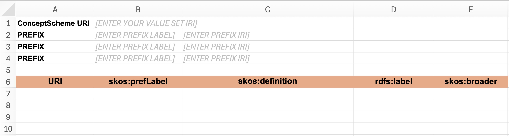
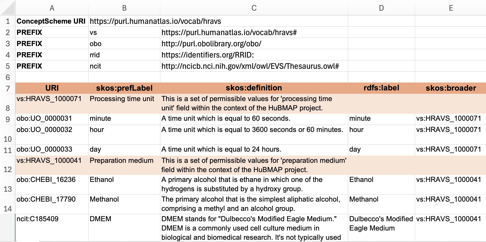

# Create Custom Value Set

Reusing terms from existing vocabularies is important for ensuring your metadata is easily interoperable. The best practice is to use a term search tool, such as the one available in [BioPortal](https://bioportal.bioontology.org/search?opt=advanced). However, there are cases where the terms used in metadata cannot be found in existing vocabularies or value sets. In such situations, creating a custom value set becomes necessary.

This page provides a step-by-step guide on how to create a custom value set and later to publish it in BioPortal so it becomes available for CEDAR templates to use.

## Method

We will use the **Simple Knowledge Organization System (SKOS)**, a data model for creating thesauri, taxonomies, controlled vocabularies, and value sets. To construct the value set's tree hierarchy, we will use an Excel spreadsheet or Google Sheets format. And finally, we will convert the spreadsheet into a SKOS-compatible file using a free online tool called [SKOSPlay](https://skos-play.sparna.fr/play/convert) so that we can upload the output to BioPortal for storing and publishing.

## Step-by-step Guide

### 1. Download the Template

* Download the [Excel spreadsheet template](../files/custom-value-set-template.xlsx).
* If you prefer working online, upload the file to **Google Drive** and open it as **Google Sheets**. 

The screenshot below shows the content of the template.

### 2. Define the Table Prefixes

The first few rows of the template define table prefixes:

* **ConceptSchemaIRI**: Enter a valid **IRI** for your value set. It can be any URL format. For example `https://purl.example.org/acme/`.
* **PREFIX**: These serves as shorthand representation of full IRIs.
  * Example: The prefix label `obo` maps to a prefix IRI `http://purl.obolibrary.org/obo/`.
  * A term written as `obo:UO_0000031` will be recognized as `http://purl.obolibrary.org/obo/UO_0000031`.

### 3. Fill in the Value Set Table

The following table describes the meaning of each column:

| Column  | Description | Example |
| --- | --- | --- |
| URI *(required)* | Unique identifier for each term, written in `[prefix]:[code]` format. | `ncit:C185409` |
| skos:prefLabel *(required)* | The label that most commonly used by your users. | DMEM |
| skos:defintion *(recommended)* | A clear definition of the term. | |
| rdfs:label *(optional)* | The official label. | Dulbecco's Modified Eagle Medium |
| skos:broader *(optional; required for child terms)* | Parent term ID, written in `[prefix]:[code]` format. | `vs:HRAVS_1000041` |

## Further Explanation

The screenshot below illustrates an example of a fully defined value set:

