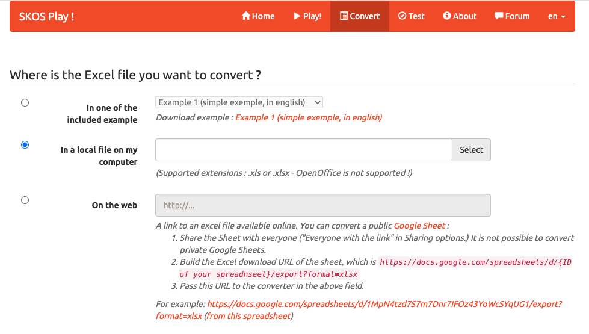

# Create Custom Value Set

Reusing terms from existing vocabularies is important for ensuring your metadata is easily interoperable. The best practice is to use a term search tool, such as the one available in [BioPortal](https://bioportal.bioontology.org/search?opt=advanced). However, there are cases where the terms used in metadata cannot be found in existing vocabularies or value sets. In such situations, creating a custom value set becomes necessary.

This page provides a step-by-step guide on how to create a custom value set and later to publish it in BioPortal so it becomes available for CEDAR templates to use.

## Method

We will use the **Simple Knowledge Organization System (SKOS)**, a data model for creating thesauri, taxonomies, controlled vocabularies, and value sets. To construct the value set's tree hierarchy, we will use an Excel spreadsheet or Google Sheets format. And finally, we will convert the spreadsheet into a SKOS-compatible file using a free online tool called [SKOSPlay](https://skos-play.sparna.fr/play/convert) so that we can upload the output to BioPortal for storing and publishing.

## Step-by-step Guide

### 1. Download the Template

* Download the [Excel spreadsheet template](../files/custom-value-set-template.xlsx).
* If you prefer working online, upload the file to **Google Drive** and open it as **Google Sheets**. 

The screenshot below shows the content of the template in Excel format.


### 2. Define the Table Prefixes

The first few rows of the template define table prefixes:

* **ConceptSchemaIRI**: Enter a valid **IRI** for your value set. It can be any URL format. For example `https://purl.example.org/acme/`.

* **PREFIX**: These serves as shorthand representation of full IRIs.
  * Example entry: 
    ```
    PREFIX    obo    http://purl.obolibrary.org/obo/
    ```
    where `obo` is known as the prefix label and `http://purl.obolibrary.org/obo/` is the prefix IRI.
  * A term written as `obo:UO_0000031` will be recognized as `http://purl.obolibrary.org/obo/UO_0000031`.


### 3. Fill in the Value Set Table

The following table describes the meaning of each column:

| Column  | Description | Example |
| --- | --- | --- |
| URI *(required)* | Unique identifier for each term, written in `[prefix]:[code]` format. The [prefix] must be equal to one of the prefix labels in the PRFIX rows.  | `ncit:C185409` |
| skos:prefLabel *(required)* | The label that most commonly used by your users. | DMEM |
| skos:defintion *(recommended)* | A clear definition of the term. | |
| rdfs:label *(optional)* | The official label. | Dulbecco's Modified Eagle Medium |
| skos:broader *(optional; required for child terms)* | Parent term ID, written in `[prefix]:[code]` format. The [prefix] must be equal to one of the prefix labels in the PRFIX rows. | `vs:HRAVS_1000041` |

## Creating Value Hierarchy

A **value hierarchy** is structured by defining **parent** and **child** terms within a value set. The **parent term** serves as a broader category, while its **child terms** are more specific concepts that fall under it. 

### **Defining a Parent Term**  
To create a **parent term**, you need to specify:  
- **URI** (Unique identifier)  
- **skos:prefLabel** (Preferred label)  
- **skos:definition** (Description of the term)  
- **rdfs:label** (Optional official label)  

**Important:** A parent term **does not** have a value in the `skos:broader` column, as it represents the top level of a hierarchy.  

### **Defining Child Terms**  
Each **child term** must:  
- Have its own **URI**  as a unique identifier.
- Reference its **parent term** by entering the parent’s URI in the `skos:broader` column  

### **Example**  

The screenshot below illustrates an example of a well-structured table.


In this example, **"Processing time unit"** is a parent term:  
- **URI**: `vs:HRAVS_1000071`  
- **skos:prefLabel**: Processing time unit
- **skos:definition**: This is a set of permissible values for 'processing time unit' field within the context of the HuBMAP project.

Its child terms, **"minute"**, **"hour"**, and **"day"**, point to it by specifying `vs:HRAVS_1000071` in the `skos:broader` column:  

| URI | skos:prefLabel | skos:broader |  
|----|---------------|--------------|  
| `obo:UO_0000031` | minute | `vs:HRAVS_1000071` |  
| `obo:UO_0000032` | hour | `vs:HRAVS_1000071` |  
| `obo:UO_0000033` | day | `vs:HRAVS_1000071` |  

Similarly, **"Preparation medium"** (`vs:HRAVS_1000041`) is another parent term, with **"Ethanol"**, **"Methanol"**, and **"DMEM"** as its child terms.

***Tip:** Use the CEDAR field name as the **preferred label** (`skos:prefLabel`) for the parent term.*

## Generating the SKOS File

To create a SKOS file with the hierarchical structure from your Excel spreadsheet, we will use SKOSPlay, a free online tool available at: https://skos-play.sparna.fr/play/convert.



### Steps to convert your Excel file:
* In the **"Convert"** page, select the second option **"In a local file on my computer"**.
* Upload your Excel file using the **"Select"** button.
* Set **"en"** as the default language if your primary language used in the value set table is English, or choose the appropriate language.
* Set **"Turtle"** as the RDF serialization format.
* Click the **"Convert"** button to finish.

The tool will process your file and generate a Turtle file for download.

### Using Google Sheets Instead of Excel

If you are working with Google Sheets, select the **"On the web"** option (third option) and enter the spreadsheet URL in the provided field. Be sure to follow the URL format required by the tool.

## Publishing the Value Set

The final step is to publish it in [BioPortal](https://bioportal.bioontology.org/) to make your value set accessible in **CEDAR**. Follow the instructions on [this page](publish-value-set.md) to learn how to upload and publish your value set in BioPortal.

## Related Topics

- Return to [building CEDAR templates page](start-here.md).
- Review the guide on [creating reusable fields](create-reusable-fields.md).