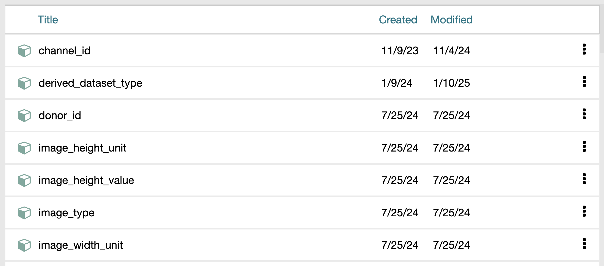
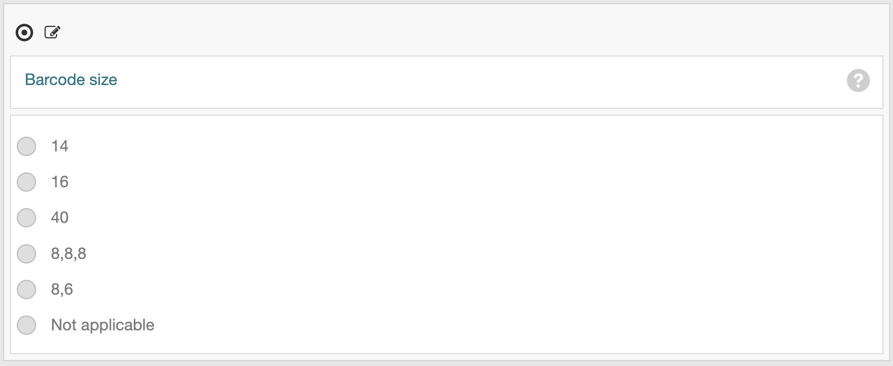
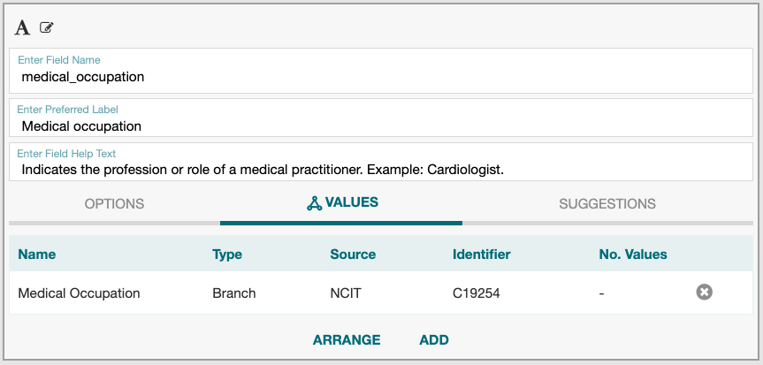

# Create Reusable Fields

Creating data fields before building the templates offers the advantage of reusability. This approach is particularly useful when you need to create multiple metadata templates and many of the fields are shared. It ensures that data fields are standardized and consistent across different templates.

At CEDAR, creating field library is straightforward. Begin by creating a new folder to organize all the common data fields. Select "New > Folder" and enter a name for the folder, such as "My Field Library".

## General Steps to Create a New Fields

1. Select "New > Field" to add a new field to your library folder.
2. A new text field is created by default. To change the field type, use the field palette on the right. CEDAR currently supports 14 field types, including number, date, image, and video.
3. Rename the field from "Untitled" to your desired name. Refer to the [naming conventions](best-practices.md) for guidance.
4. Next, provide the preferred label and description for the field.

Fields often have value restrictions where only specific entries are allowed as valid inputs. The section below outlines the steps to define these permissible values.

## Creating a Field with Permissible Values

Depending on your requirements, there are three options in creating a text field with permissible values:

### When the values are plain strings

1. Change the field type to "Multiple Choice" from the field palette.
2. Add the controlled terms as option value strings. The figure below illustrates an example of using a multiple-choice field to enumerate all possible barcode sizes.
   
   

### When the values come from an ontology term

1. Select the "VALUES" setting and click "Add".
2. Type the controlled term label in the "Search in BioPortal" field. If you know the ontology name in advance, enter it in the "Narrow your search to specific ontologies" field.
3. Select the resulting term and click "Add". Ensure the "TERM" option is selected, not "BRANCH" or "ONTOLOGY".
4. Repeat this process until you have added all the controlled term labels. The figure below illustrates an example of using controlled values from ontologies to enumerate all possible processing time units.
   
   

### When the values come from an ontology branch or a custom value set

1. Select the "VALUES" setting and click "Add".
2. Type the controlled term label in the "Search in BioPortal" field. If you know the ontology or value set name in advance, enter it in the "Narrow your search to specific ontologies" field.
3. Select the resulting term and click "Add". Ensure the "BRANCH" option is selected, not "TERM" or "ONTOLOGY". The figure below illustrates an example of using a branch from the NCI Thesaurus (NCIT) to include all medical occupations. Clicking the "Arrange" button displays the list of the occupations, such as "Cardiologist", "Clinical Pathologist", "Coroner", "Dermatologist".

   

## Related Topics

- Return to [building CEDAR templates page](build-templates.md).
- Learn about [naming conventions](best-practices.md).
- See [examples of completed templates](https://github.com/hubmapconsortium/dataset-metadata-spreadsheet).
