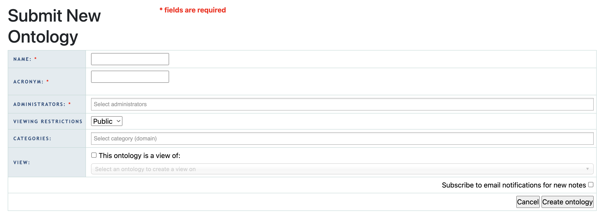
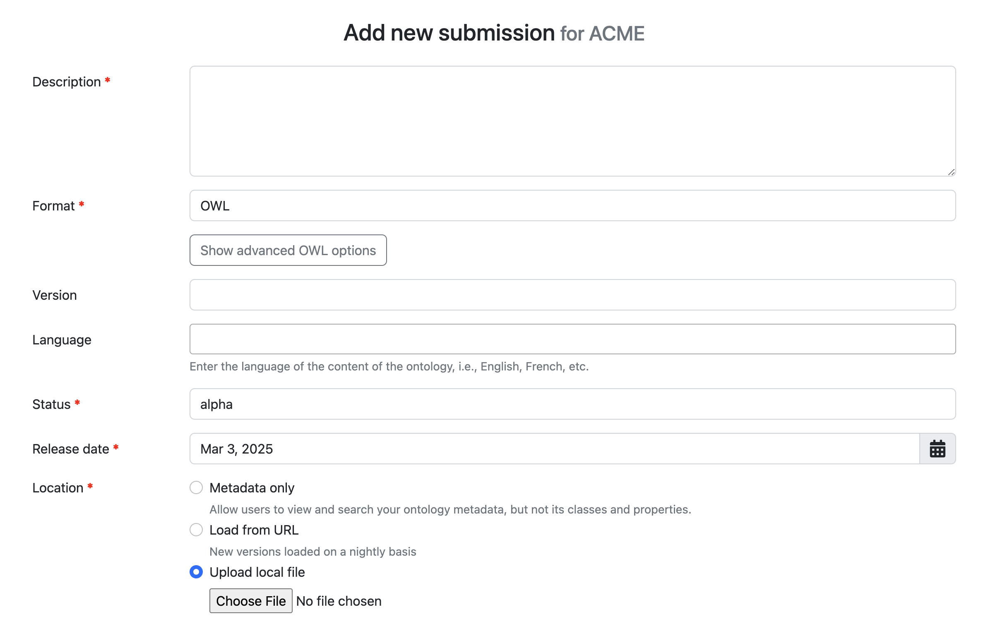
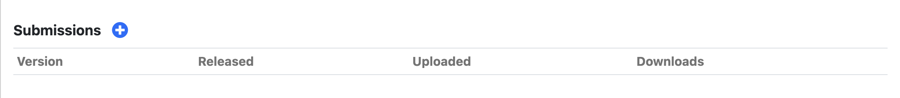

# Publish Value Set to BioPortal

To make your **value set** accessible to **CEDAR**, follow these steps to publish it on **BioPortal**.  

## First Time Submission

### Step 1: Create a BioPortal Account
* Go to **[BioPortal](https://bioportal.bioontology.org/)**.  
* Fill out the [registration form](https://bioportal.bioontology.org/accounts/new) if you don't have a BioPortal account, otherwise proceed to log in to your account.

### Step 2: Register a New Ontology

* Visit the "Submit New Ontology" page:
   - Click **"Ontologies"** in the top navigation bar.
   - Click the **"Submit New Ontology"** button from the left panel.
  
* Fill in the required details:
  

   - **Name**: → Enter a meaningful name for your value set.  
   - **Acronym:** → Provide a short, unique identifier (e.g., `ACME`).  
   - **Administrators:** → Optionally, add another BioPortal users as the administrator.  
   - **Viewing Restrictions:** → Keep it **"Public"** for CEDAR access.
   - **Categories:** → Choose an appropriate category from the drop-down list.
   - **View:** → Leave unselected.
   - Optionally, subscribe to email notification.
   - Click the **"Create ontology"** button to finish.

### Step 3: Create a new Submission

Fill in the required details to create a new submission:
  

- **Description:** → Write a meaningful description about the value set.
- **Format:** → Select **"SKOS"** for the format.
- **Version:** → Enter a version number (e.g., **"1.0.0"**).
- **Language:** → Select **"English"** as the language, or specify another language.
- **Status:** → Select **"alpha"** or **"beta"** for preview versions, or **"production"** for public use.
- **Release date:** → Make sure to select today's date.
- **Location:** → Choose **"Upload local file"** option and select your SKOS file.
- **Contact:** → Provide the name and email of the responsible person.
- Optionally, add **Homepage URL**, **Documentation URL**, or **Publications DOI**.
- Click the **"Add submission"** button to finish.

## Subsequent Submission

* Visit your value set's page, for example: https://bioportal.bioontology.org/ontologies/ACME, where **ACME** your registered acronym from the value set.
* Click the plus button on the **Submissions** table to open the submission form.
  
* Provide the updated details:
    - **Version:** → Increment the version number from the previous version (e.g., **1.1.0**).
    - **Status:** → Update if necessary.
    - **Release date:** → Select today's date.
    - **Location:** → Upload the new SKOS file.
* Click the **"Add submission"** button to finish.

## Related Topics

- Return to [building CEDAR templates page](start-here.md).