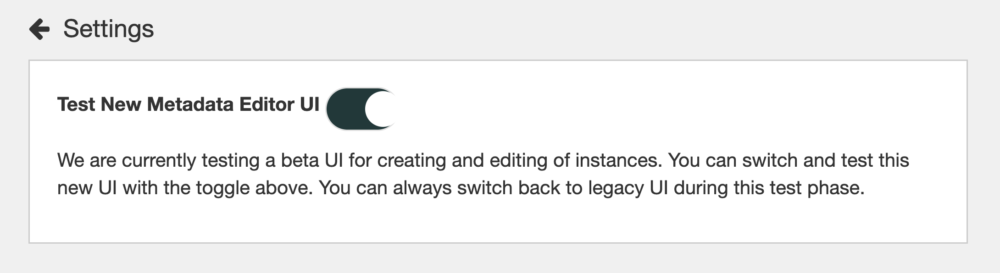
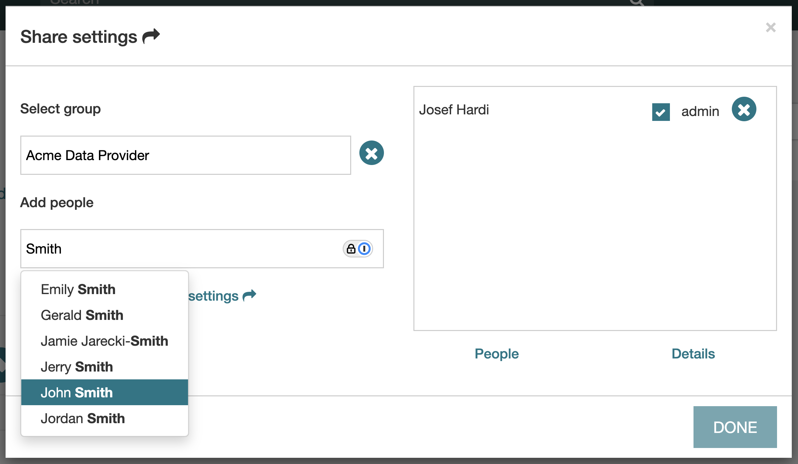
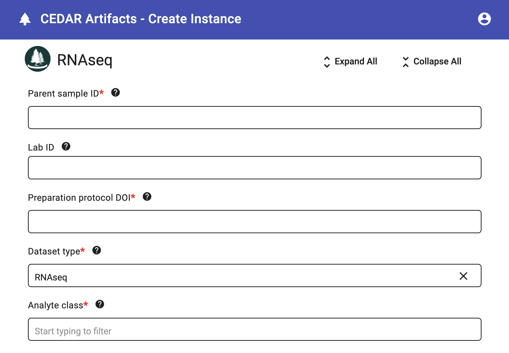

# Collect Metadata via Web Forms

CEDAR is a platform for designing metadata templates and collecting metadata records over the Web. One of its key features is the ability to acquire the records from users with CEDAR accounts by sharing the templates as Web forms. Similar to [Google Forms](https://workspace.google.com/products/forms/), this functionality allows template designers to generate a fillable form link that others can use to input metadata values.

When users submit data through the form, the collected metadata records are stored in a centralized location owned by the person who shared the form link. This approach streamlines metadata collection from multiple contributors, ensuring consistency and easy access to submitted records.

## Preparation

To enable this feature, start by logging into CEDAR and accessing your account settings. Click on the Profile icon in the upper right corner, then select Settings. In the settings menu, toggle on "**Test New Metadata Editor UI**" to switch to the latest interface for creating and editing metadata records (see figure below). 

This updated UI, currently in Beta, provides an improved user experience for managing metadata instances. Once enabled, navigate back to your CEDAR workspace and find the template you want to share as a web form.

## Creating User Group

Follow these steps to create a new user group:

1. Open the template’s **Resource Menu** (the **⋮ kebab menu** on the right-hand side of the template) and select **"Share..."**.  
2. In the dialog window that appears, click **"Group settings"** to open the group setup window.  
3. Enter a name for your group in the **"Enter new group name"** text field and click **"OK"** to create it.  
4. To add members, use the **"Enter user name"** search bar to find and select users who have CEDAR accounts. Click **"OK"** to register each user. See figure below for an illustration.

NOTE: It is recommended that you assign yourself the **Admin** role and disable administrative permissions for others to maintain control over the group.  

5. Repeat *Step 4* until all desired members have been added.  

Once the group is set up, click **"Share settings"** to return to the previous dialog window and configure sharing settings. Locate your newly created group by typing its name in the **"Enter group name"** field, select it, and set the permission to **"can read"** only. Click **"Done"**, and your template will now be shared with your group members.

### Editing a User Group

To edit an existing user group, follow these steps:  

1. Start by opening the **Group settings** dialog to open the group management window.  
3. Use the **"Enter group name"** field to retrieve your existing group.  
4. To **add new members**, use the **"Enter user name"** search bar to find and select users who have CEDAR accounts, then click **"OK"** to add them.  
5. To **remove existing members**, locate the user in the list and remove them from the group.  
6. If necessary, update administrative roles—ensure that you remain the **Admin** and limit admin access for others as needed.  
7. Once all changes are made, return to workspace to save the group settings.  

Your user group is now updated with the new membership and permissions.

## Acquiring Metadata Records

Before generating a Web form link for metadata collection, it is important to ensure that submitted records are stored in an organized manner. To do this, follow these steps:  

1. **Create a new folder** in your CEDAR workspace to store the metadata records.  
2. **Move the template** into the newly created folder, as all metadata records generated from the form will be stored alongside the template.  
3. Open the template’s **Resource Menu** (**the kebab menu ⋮**) and select **"Populate"**.  
4. This action will generate the Web form, allowing users to enter metadata values (see figure).
  

5. Once the form is displayed, **copy the URL** from the browser’s address bar.  
6. Share this URL with users to collect metadata records.

**Note:** Anyone accessing the provided URL must log in to CEDAR before filling out the form. Additionally, only users who are part of the user group will be able to submit metadata records.

## Related Topics

- Review the guide on [creating reusable fields](create-reusable-fields.html).
- Learn about the [naming conventions](best-practices.html).